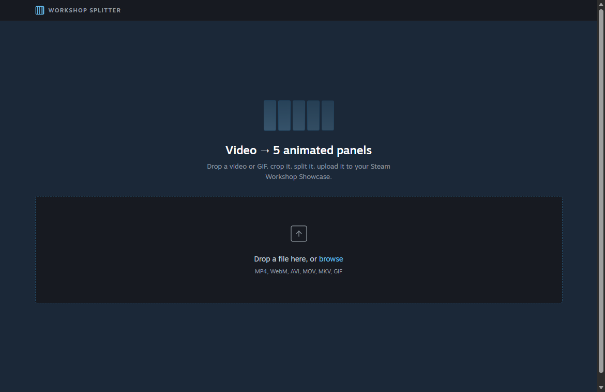

# Workshop Splitter

Turn any video or GIF into an animated 5-panel showcase for your Steam profile.



---

## Download

**[Download WorkshopSplitter.exe](https://github.com/ayricky/steam-workshop-splitter/releases/latest/download/WorkshopSplitter.exe)** — Windows, no install needed. Just run it.

> SmartScreen may warn you since the exe isn't signed — click "More info" → "Run anyway".

### Run from source

```
git clone https://github.com/ayricky/steam-workshop-splitter.git
cd steam-workshop-splitter
pip install -r requirements.txt
python app.py
```

Requires Python 3.10+.

---

## After uploading

Go to your Steam profile → **Edit Profile** → **Showcases** → **Workshop Showcase** → add all 5 items in order, left to right.

Panels may look out of sync on first load — refresh the page once they're cached.

## License

MIT
